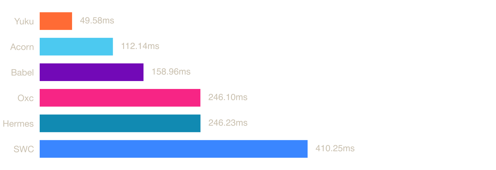
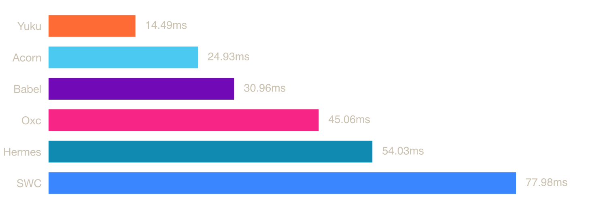

# ECMAScript Parser Benchmark (npm)

Benchmarks for ECMAScript parsers available as npm packages, including pure JavaScript parsers and native parsers (Zig, Rust) via NAPI bindings.

## System

| Property | Value |
|----------|-------|
| OS | macOS 24.6.0 (arm64) |
| CPU | Apple M4 Pro (Virtual) |
| Cores | 6 |
| Memory | 14 GB |

## Parsers

### [Acorn](https://github.com/acornjs/acorn)

A tiny, fast JavaScript parser, written completely in JavaScript.

### [Babel](https://github.com/babel/babel/tree/main/packages/babel-parser)

A JavaScript compiler and parser used by the Babel toolchain.

### [Hermes](https://github.com/nicolo-ribaudo/hermes-parser)

A JavaScript engine optimized for React Native, with a standalone parser available via WASM.

### [Oxc](https://github.com/oxc-project/oxc)

A high-performance JavaScript and TypeScript parser written in Rust.

### [SWC](https://github.com/swc-project/swc)

An extensible Rust-based platform for compiling and bundling JavaScript and TypeScript.

### [Yuku](https://github.com/yuku-toolchain/yuku)

A high-performance & spec-compliant JavaScript/TypeScript compiler written in Zig.

## Benchmarks

### [typescript.js](https://raw.githubusercontent.com/yuku-toolchain/parser-benchmark-files/refs/heads/main/typescript.js)

**File size:** 7.83 MB



| Parser | Mean | Min | Max |
|--------|------|-----|-----|
| Yuku | 49.58 ms | 46.89 ms | 59.87 ms |
| Acorn | 112.14 ms | 103.43 ms | 128.64 ms |
| Babel | 158.96 ms | 122.58 ms | 212.65 ms |
| Oxc | 246.10 ms | 227.59 ms | 271.69 ms |
| Hermes | 246.23 ms | 217.60 ms | 315.08 ms |
| SWC | 410.25 ms | 399.51 ms | 439.69 ms |

### [three.js](https://raw.githubusercontent.com/yuku-toolchain/parser-benchmark-files/refs/heads/main/three.js)

**File size:** 1.96 MB



| Parser | Mean | Min | Max |
|--------|------|-----|-----|
| Yuku | 14.49 ms | 13.82 ms | 20.24 ms |
| Acorn | 24.93 ms | 23.80 ms | 31.32 ms |
| Babel | 30.96 ms | 24.47 ms | 39.63 ms |
| Oxc | 45.06 ms | 43.05 ms | 54.46 ms |
| Hermes | 54.03 ms | 50.12 ms | 66.54 ms |
| SWC | 77.98 ms | 75.32 ms | 87.72 ms |

### [react.js](https://raw.githubusercontent.com/yuku-toolchain/parser-benchmark-files/refs/heads/main/react.js)

**File size:** 0.07 MB


| Parser | Mean | Min | Max |
|--------|------|-----|-----|
| Yuku | 0.35 ms | 0.33 ms | 4.95 ms |
| Acorn | 0.82 ms | 0.77 ms | 4.06 ms |
| Babel | 0.91 ms | 0.81 ms | 3.42 ms |
| Oxc | 1.38 ms | 1.31 ms | 3.22 ms |
| Hermes | 1.66 ms | 1.53 ms | 6.21 ms |
| SWC | 2.52 ms | 2.44 ms | 3.67 ms |

## Run Benchmarks

### Prerequisites

- [Bun](https://bun.sh/) - JavaScript runtime and package manager

### Steps

1. Clone the repository:

```bash
git clone https://github.com/yuku-toolchain/ecmascript-parser-benchmark-js.git
cd ecmascript-parser-benchmark-js
```

2. Install dependencies:

```bash
bun install
```

3. Run benchmarks:

```bash
bun bench
```

This will run benchmarks on all test files. Results are saved to the `result/` directory.

## Methodology

Each parser is benchmarked using [Tinybench](https://github.com/tinylibs/tinybench) with warmup iterations followed by multiple timed runs. Each run measures the time to parse the source text into an AST. Source files are read from disk once and kept in memory for all iterations.

Native parsers (Oxc, SWC, Yuku) run through their respective NAPI bindings, so measured time includes the binding overhead. Pure JS parsers (Acorn, Babel) run directly in the JavaScript runtime.

**A note on Oxc:** Oxc has an `experimentalRawTransfer` option that makes `oxc-parser` roughly 2-3x faster than the results shown above. However, it is currently experimental and comes with significant limitations: it only works in Node.js (not Bun, Deno, etc.), and it allocates gigabytes of memory upfront for a single parse, leading to out-of-memory errors on many systems and failures when parsing files in parallel.