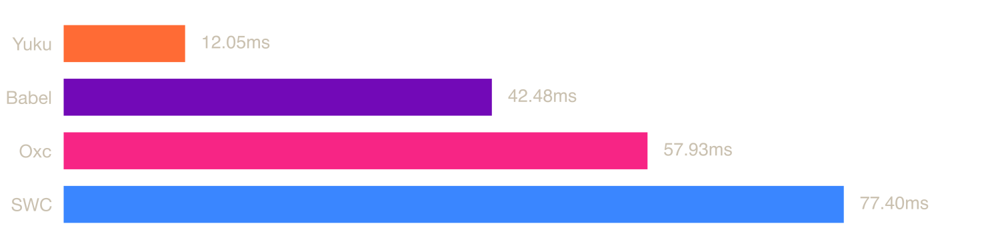

# ECMAScript Parser Benchmark (npm)

Benchmarks for ECMAScript parsers available as npm packages, including pure JavaScript parsers and native parsers (Zig, Rust) via NAPI bindings.

## System

| Property | Value |
|----------|-------|
| OS | macOS 24.6.0 (arm64) |
| CPU | Apple M3 |
| Cores | 8 |
| Memory | 16 GB |

## Parsers

### [Acorn](https://github.com/acornjs/acorn)

A tiny, fast JavaScript parser, written completely in JavaScript.

### [Babel](https://github.com/babel/babel/tree/main/packages/babel-parser)

A JavaScript compiler and parser used by the Babel toolchain.

### [Oxc](https://github.com/oxc-project/oxc)

A high-performance JavaScript and TypeScript parser written in Rust.

### [SWC](https://github.com/swc-project/swc)

An extensible Rust-based platform for compiling and bundling JavaScript and TypeScript.

### [Yuku](https://github.com/yuku-toolchain/yuku)

A high-performance & spec-compliant JavaScript/TypeScript compiler written in Zig.

## Benchmarks

### [typescript.js](https://raw.githubusercontent.com/yuku-toolchain/parser-benchmark-files/refs/heads/main/typescript.js)

**File size:** 7.83 MB


| Parser | Mean | Min | Max | Ops/sec | Relative |
|--------|------|-----|-----|---------|----------|
| **Yuku** | **57.88 ms** | **52.84 ms** | **109.25 ms** | **17.28 ops/s** | **baseline** |
| Acorn | 136.13 ms | 124.57 ms | 160.60 ms | 7.35 ops/s | 2.35× slower |
| Babel | 175.90 ms | 135.18 ms | 212.13 ms | 5.68 ops/s | 3.04× slower |
| Oxc | 270.98 ms | 260.61 ms | 331.25 ms | 3.69 ops/s | 4.68× slower |
| SWC | 473.88 ms | 453.66 ms | 557.01 ms | 2.11 ops/s | 8.19× slower |

### [calcom.tsx](https://raw.githubusercontent.com/yuku-toolchain/parser-benchmark-files/refs/heads/main/calcom.tsx)

**File size:** 1.01 MB



| Parser | Mean | Min | Max | Ops/sec | Relative |
|--------|------|-----|-----|---------|----------|
| **Yuku** | **12.05 ms** | **10.02 ms** | **38.10 ms** | **82.99 ops/s** | **baseline** |
| Babel | 42.48 ms | 32.67 ms | 58.98 ms | 23.54 ops/s | 3.53× slower |
| Oxc | 57.93 ms | 54.14 ms | 91.35 ms | 17.26 ops/s | 4.81× slower |
| SWC | 77.40 ms | 67.78 ms | 166.21 ms | 12.92 ops/s | 6.42× slower |
| Acorn | Failed to parse | - | - | - | - |

### [react.js](https://raw.githubusercontent.com/yuku-toolchain/parser-benchmark-files/refs/heads/main/react.js)

**File size:** 0.07 MB


| Parser | Mean | Min | Max | Ops/sec | Relative |
|--------|------|-----|-----|---------|----------|
| **Yuku** | **0.44 ms** | **0.36 ms** | **5.62 ms** | **2286.88 ops/s** | **baseline** |
| Acorn | 1.05 ms | 0.96 ms | 20.37 ms | 949.43 ops/s | 2.41× slower |
| Oxc | 1.54 ms | 1.48 ms | 6.84 ms | 647.57 ops/s | 3.53× slower |
| Babel | 1.73 ms | 1.17 ms | 23.11 ms | 576.57 ops/s | 3.97× slower |
| SWC | 2.82 ms | 2.71 ms | 7.46 ms | 354.77 ops/s | 6.45× slower |

## Run Benchmarks

### Prerequisites

- [Bun](https://bun.sh/) - JavaScript runtime and package manager

### Steps

1. Clone the repository:

```bash
git clone https://github.com/yuku-toolchain/ecmascript-parser-benchmark-js.git
cd ecmascript-parser-benchmark-js
```

2. Install dependencies:

```bash
bun install
```

3. Run benchmarks:

```bash
bun bench
```

This will run benchmarks on all test files. Results are saved to the `result/` directory.

## Methodology

Each parser is benchmarked using [Tinybench](https://github.com/tinylibs/tinybench) with warmup iterations followed by multiple timed runs. Each run measures the time to parse the source text into an AST. Source files are read from disk once and kept in memory for all iterations.

Native parsers (Oxc, SWC, Yuku) run through their respective NAPI bindings, so measured time includes the binding overhead. Pure JS parsers (Acorn, Babel) run directly in the JavaScript runtime.

**Why is Oxc slower than Babel?** Oxc's npm package serializes the AST to a JSON string on the Rust side, then calls `JSON.parse` on the JavaScript side to make it available. This overhead makes it slower in end-to-end benchmarks, even though Oxc is very fast at raw parsing speed. If you only call the `parse` function without accessing the result, Oxc appears faster than Babel because the `program` field is a getter that defers `JSON.parse` until access. The benchmarks above measure the time to actually obtain the full AST for all parsers.

Oxc also has an `experimentalRawTransfer` option that makes `oxc-parser` roughly 2-3x faster than the results shown above. However, it is currently experimental and comes with significant limitations: it only works in Node.js (not Bun, Deno, etc.), and it allocates gigabytes of memory upfront for a single parse, leading to out-of-memory errors on many systems and failures when parsing files in parallel.

**Why is Yuku fast?** Yuku's AST is designed from the ground up to be transfer-friendly: flat, compact, and near-binary. Instead of serializing to JSON and parsing it back, the AST produced by the Zig parser can be passed to JavaScript with minimal conversion. Zig's comptime makes this safe by design. There are no multi-gigabyte allocations, only the memory the source being parsed actually needs.