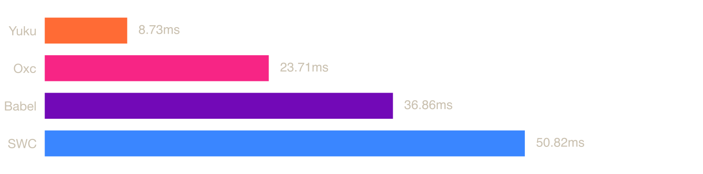

# ECMAScript Parser Benchmark (npm)

Benchmarks for ECMAScript parsers available as npm packages, including pure JavaScript parsers and native parsers (Zig, Rust) via NAPI bindings.

## System

| Property | Value |
|----------|-------|
| OS | macOS 25.6.0 (arm64) |
| CPU | Apple M3 |
| Cores | 8 |
| Memory | 16 GB |

## Parsers

### [Acorn](https://github.com/acornjs/acorn)

A tiny, fast JavaScript parser, written completely in JavaScript.

### [Babel](https://github.com/babel/babel/tree/main/packages/babel-parser)

A JavaScript compiler and parser used by the Babel toolchain.

### [Oxc](https://github.com/oxc-project/oxc)

A high-performance JavaScript and TypeScript parser written in Rust.

### [SWC](https://github.com/swc-project/swc)

An extensible Rust-based platform for compiling and bundling JavaScript and TypeScript.

### [Yuku](https://github.com/yuku-toolchain/yuku)

A high-performance & spec-compliant JavaScript/TypeScript compiler written in Zig.

## Benchmarks

### [typescript.js](https://raw.githubusercontent.com/yuku-toolchain/parser-benchmark-files/refs/heads/main/typescript.js)

**File size:** 7.83 MB


| Parser | Median | RME | Mean | Min | Max | Ops/sec | Relative |
|--------|--------|-----|------|-----|-----|---------|----------|
| **Yuku** | **45.00 ms** | **±0.59%** | **45.39 ms** | **42.60 ms** | **57.92 ms** | **22.22 ops/s** | **baseline** |
| Acorn | 144.54 ms | ±1.74% | 145.85 ms | 125.37 ms | 216.86 ms | 6.92 ops/s | 3.21× slower |
| Babel | 163.80 ms | ±2.64% | 165.72 ms | 133.78 ms | 222.11 ms | 6.11 ops/s | 3.64× slower |
| Oxc | 210.73 ms | ±0.21% | 211.18 ms | 208.49 ms | 217.12 ms | 4.75 ops/s | 4.68× slower |
| SWC | 374.01 ms | ±1.18% | 381.96 ms | 367.59 ms | 496.17 ms | 2.67 ops/s | 8.31× slower |

### [checker.ts](https://raw.githubusercontent.com/yuku-toolchain/parser-benchmark-files/refs/heads/main/checker.ts)

**File size:** 2.95 MB


| Parser | Median | RME | Mean | Min | Max | Ops/sec | Relative |
|--------|--------|-----|------|-----|-----|---------|----------|
| **Yuku** | **16.88 ms** | **±0.55%** | **17.13 ms** | **15.60 ms** | **39.22 ms** | **59.23 ops/s** | **baseline** |
| Oxc | 62.16 ms | ±0.78% | 63.38 ms | 60.59 ms | 108.56 ms | 16.09 ops/s | 3.68× slower |
| Babel | 67.34 ms | ±1.25% | 67.67 ms | 53.97 ms | 110.63 ms | 14.85 ops/s | 3.99× slower |
| SWC | 121.14 ms | ±0.27% | 121.47 ms | 118.76 ms | 127.58 ms | 8.25 ops/s | 7.18× slower |
| Acorn | Failed to parse | - | - | - | - | - | - |

### [lib.dom.d.ts](https://raw.githubusercontent.com/yuku-toolchain/parser-benchmark-files/refs/heads/main/lib.dom.d.ts)

**File size:** 2.24 MB



| Parser | Median | RME | Mean | Min | Max | Ops/sec | Relative |
|--------|--------|-----|------|-----|-----|---------|----------|
| **Yuku** | **8.67 ms** | **±0.68%** | **8.76 ms** | **7.89 ms** | **36.38 ms** | **115.37 ops/s** | **baseline** |
| Oxc | 23.87 ms | ±0.89% | 24.24 ms | 23.03 ms | 75.74 ms | 41.89 ops/s | 2.75× slower |
| Babel | 36.17 ms | ±1.24% | 36.54 ms | 30.91 ms | 69.46 ms | 27.64 ops/s | 4.17× slower |
| SWC | 50.77 ms | ±0.64% | 50.93 ms | 49.38 ms | 83.83 ms | 19.70 ops/s | 5.86× slower |
| Acorn | Failed to parse | - | - | - | - | - | - |

### [react.js](https://raw.githubusercontent.com/yuku-toolchain/parser-benchmark-files/refs/heads/main/react.js)

**File size:** 0.07 MB


| Parser | Median | RME | Mean | Min | Max | Ops/sec | Relative |
|--------|--------|-----|------|-----|-----|---------|----------|
| **Yuku** | **0.29 ms** | **±0.39%** | **0.33 ms** | **0.28 ms** | **2.35 ms** | **3457.71 ops/s** | **baseline** |
| Acorn | 0.85 ms | ±0.31% | 0.89 ms | 0.79 ms | 21.06 ms | 1179.88 ops/s | 2.93× slower |
| Babel | 1.12 ms | ±0.72% | 1.26 ms | 0.90 ms | 15.86 ms | 896.48 ops/s | 3.86× slower |
| Oxc | 1.12 ms | ±0.42% | 1.18 ms | 1.09 ms | 16.07 ms | 890.37 ops/s | 3.88× slower |
| SWC | 2.09 ms | ±0.47% | 2.17 ms | 2.04 ms | 26.09 ms | 477.56 ops/s | 7.24× slower |

## Run Benchmarks

### Prerequisites

- [Bun](https://bun.sh/) - JavaScript runtime and package manager

### Steps

1. Clone the repository:

```bash
git clone https://github.com/yuku-toolchain/ecmascript-parser-benchmark-js.git
cd ecmascript-parser-benchmark-js
```

2. Install dependencies:

```bash
bun install
```

3. Download the benchmark files:

```bash
bun load-files
```

4. Run benchmarks:

```bash
bun bench
```

This will run benchmarks on all test files. Results are saved to the `result/` directory.

Benchmark duration is configurable via the environment variables `BENCH_TIME` (timed duration per run in ms, default 10000), `BENCH_WARMUP` (warmup duration in ms, default 2000), and `BENCH_RUNS` (independent runs per parser, default 3). For the most stable numbers, run on AC power with no other applications running.

## Methodology

Each parser is benchmarked using [Tinybench](https://github.com/tinylibs/tinybench) with warmup iterations followed by multiple timed runs. Each run measures the time to parse the source text into an AST. Source files are read from disk once and kept in memory for all iterations.

To keep results stable and fair, every parser × file combination runs in its own freshly spawned process, so JIT state and GC pressure from one parser never affect another. Each combination is benchmarked in multiple independent runs (3 by default), and the reported median is the median across those runs, a statistic that is robust to GC pauses, OS scheduling blips, and other outliers. The RME column shows the relative margin of error (99% confidence) within a run. Differences between parsers smaller than their combined margins should be treated as noise.

Native parsers (Oxc, SWC, Yuku) run through their respective NAPI bindings, so measured time includes the binding overhead. Pure JS parsers (Acorn, Babel) run directly in the JavaScript runtime.

`lib.dom.d.ts` is a global declaration script with no imports or exports. SWC parses it as a script rather than a module, because its npm binding otherwise rejects the file's `...arguments` parameter names under module strict mode.

**Why is Oxc slower than Babel here?** By default, `oxc-parser` serializes the AST to a JSON string on the Rust side and runs `JSON.parse` on the JavaScript side when you access `result.program`. Oxc's Rust-side parsing is extremely fast. It is this serialization boundary that dominates the end-to-end time. (If you call `parseSync` and never touch the result, Oxc looks much faster, because `program` is a lazy getter that defers the `JSON.parse`. The benchmarks above measure the time to actually obtain the full AST, which is what any real consumer of a parser does.)

**What about Oxc's `experimentalRawTransfer`?** Oxc also has a hidden experimental path that removes the JSON step entirely. It is not part of Oxc's documented parser options, but when the flag is passed, Rust parses directly into a huge `ArrayBuffer` shared with JavaScript, and generated JS code deserializes AST nodes straight out of that memory. It is genuinely clever engineering, and with it enabled Oxc's end-to-end numbers land much closer to Yuku's, since the two pipelines become architecturally the same (binary buffer in, ESTree objects out).

It is not part of the results above for a simple reason. This benchmark measures each parser's default, documented, stable API, the code path every user gets from `npm install`. Raw transfer today is an undocumented flag that is none of those things, and it cannot run here at all.

- **It does not work on Bun**, which this benchmark runs on. `oxc-parser`'s own `rawTransferSupported()` check returns `false` on Bun, and on Node < 22 and Deno < 2, because the design requires allocating an `ArrayBuffer` larger than 4 GiB. Enabling the option in this harness would simply throw.
- **It needs gigabytes of reserved memory per parse.** The trick that makes it fast is that the Rust arena is a fixed 2 GiB block aligned to a 4 GiB boundary, so 64-bit Rust pointers can be read from JavaScript as 32-bit buffer offsets. Achieving that alignment means reserving ~6 GiB of address space per buffer. Most of it stays virtual until touched, but every concurrent parse still needs its own dedicated 2 GiB arena, source and AST together must fit inside that block, and only 64-bit little-endian platforms are supported.

If Oxc stabilizes raw transfer as its default path, we will happily benchmark it. That is the fair comparison we want.

**Why is Yuku fast without any of that?** Yuku reaches the same zero-serialization end state, but by construction rather than by workaround. Its Zig parser does not build a pointer graph that later needs remapping. The AST *is already binary*, a flat table of fixed-size 44-byte node records addressed by index, with strings stored as offsets into the source. That layout is its own transfer format. It crosses the NAPI boundary as one small buffer sized to the actual AST, and a generated decoder reads it in JavaScript through typed arrays, conceptually the same read side as Oxc's raw transfer minus the pointer-to-offset machinery that forces the giant fixed arena.

Because there are no pointers to remap, there is no 2 GiB block, no 4 GiB alignment requirement, no multi-gigabyte reservation, and no runtime gate. The same code path runs on Node, Bun, and Deno, parses files in parallel without multiplying memory, and uses only the memory the file actually needs. Zig's comptime generates both the binary layout and the JavaScript decoder from one source of truth, so they can never drift apart. The numbers in the tables above are Yuku's default and only mode. There is no faster experimental path being held back and nothing extra to enable.